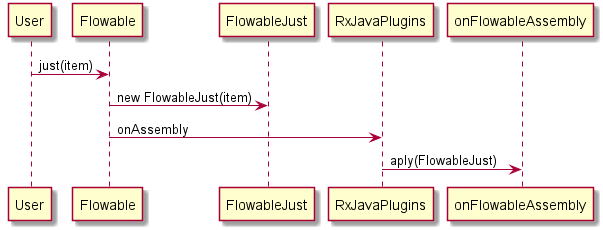

# 创建FlowableJust


```java
 static final int BUFFER_SIZE;
    static {
        BUFFER_SIZE = Math.max(1, Integer.getInteger("rx2.buffer-size", 128));
    }


```

通过System.property获取rx2.buffer-size的值，如果没有就为128

```java
  System.setProperty("rx2.buffer-size", "100");
        System.out.println("rx2.buffer-size:" + Integer.getInteger("rx2.buffer-size"));
        Integer j = Integer.getInteger("sun.arch.data.model", 134);
        System.out.println("sun.arch.data.model:" + j);

```

```Console
rx2.buffer-size:100
sun.arch.data.model:64

Process finished with exit code 0


```

Flowable.just方法会生成一个Flowable\<T>的对象
```java
 public static <T> Flowable<T> just(T item) {
        ObjectHelper.requireNonNull(item, "item is null");
        return RxJavaPlugins.onAssembly(new FlowableJust<T>(item));
    }

```

需要不为空的办法，其实就是一个非空判断值得学习
```java
public static <T> T requireNonNull(T object, String message) {
    if (object == null) {
        throw new NullPointerException(message);
    }
    return object;
}


```

然后是走 RxJavaPlugins.onAssembly(new FlowableJust<T>(item))
```java
 static volatile Function<? super Flowable, ? extends Flowable> onFlowableAssembly;
  public static <T> Flowable<T> onAssembly(@NonNull Flowable<T> source) {
        Function<? super Flowable, ? extends Flowable> f = onFlowableAssembly;
        if (f != null) {
            return apply(f, source);
        }
        return source;
    }

```

可以看出来，就是想通过用户的plugin来订制这个FlowableJust.



